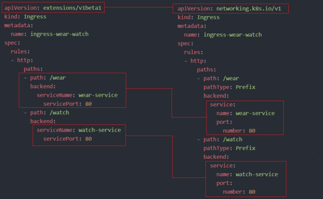

# Article: Ingress

As we already discussed **Ingress** in our previous lecture. Here is an
update.

In this article, we will see what changes have been made in previous and
current versions in **Ingress**.

Like in **apiVersion**, **serviceName** and **servicePort** etc.

<figure>

</figure>

Now, in k8s version **1.20+** we can create an Ingress resource from the
imperative way like this:-

```
kubectl create ingress $INGRESS_NAME
--rule="host/path=service:port"
```

Example

```
kubectl create ingress ingress-test
--rule="wear.my-online-store.com/wear\*=wear-service:80"
```

Find more information and examples in the below reference link:-

- https://kubernetes.io/docs/reference/generated/kubectl/kubectl-commands#-em-ingress-em-

**References:-**

- https://kubernetes.io/docs/concepts/services-networking/ingress
- https://kubernetes.io/docs/concepts/services-networking/ingress/#path-types
